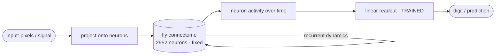

<p align="center">
  
</p>

<h1 align="center">wetware</h1>

<p align="center">
  <strong>Compute on a real brain.</strong><br />
  The complete fruit-fly connectome, run as a fixed reservoir. The wiring never learns — it's the animal's brain. A one-layer readout does.
</p>

<p align="center">
  <a href="#license"></a>
  
  
  
  <a href="https://github.com/Roxx0x/wetware/actions/workflows/test.yml"></a>
</p>

## What this is

In 2023 scientists finished the first synapse-resolution wiring diagram of an entire animal brain — the larval fruit fly. **2952 neurons, ~110,000 connections, every one mapped.** It's public.

`wetware` takes that brain, freezes it, and uses it as a computer.

The trick is reservoir computing: a fixed recurrent network can do real computation if you feed signals in and train a thin linear layer to read the activity back out. So we drive the fly's actual wiring with input, and train a one-layer readout on top. **The brain is never modified — you can't edit an animal's connectome — only the readout learns.** It's a real technique on real biological hardware (see [the science](#the-science)).

And it works:

```
$ wetware run digits
{
  "task": "digits",
  "accuracy": 0.94,             # a real fly brain reading handwritten digits
  "baseline_accuracy": 0.10,
  "neurons": 2952
}
```

<p align="center">
  
</p>

That 94% is the fly's brain, wired as nature left it, reading handwriting it has never seen — with only a linear readout trained on top.

## Quickstart

```
pip install "git+https://github.com/Roxx0x/wetware"
```

```python
from wetware import load
from wetware.tasks import digits, timeseries

W, ids = load()               # downloads the real fly connectome once (~1 MB), then instant
print(digits.demo(W))         # train a readout to read handwriting  -> ~94%
print(timeseries.demo(W))     # predict a nonlinear time-series      -> beats baseline 2x
```

```
wetware download              # fetch + cache the connectome
wetware info                  # neurons, connections, density
wetware run digits            # read handwriting on the real brain
wetware run timeseries        # predict the future on the real brain
wetware --sample run digits   # offline synthetic stand-in, no download
```

> [!TIP]
> No download needed to kick the tyres: `--sample` runs everything on a small synthetic network with the same statistics. But anything you publish should run on the real thing — `load()` — because the real thing is the entire point.

## How it works



1. **Load** the connectome as a weighted wiring matrix `W` (who connects to whom, by synapse count).
2. **Fix it** — scale it to the echo-state regime and never touch it again. This is the brain.
3. **Drive it** with your input and record how every neuron responds over time.
4. **Train** a single linear readout (ridge regression, closed-form — no backprop) to turn that activity into an answer.

Swap the task, keep the brain. That's what makes it universal: the same fixed brain reads digits, predicts a series, or — with a new readout — whatever you throw at it.

## Tasks

| task | what the brain does | result on the real connectome |
|---|---|---|
| `digits` | read 8x8 handwritten digits | **~94%** accuracy (baseline 10%) |
| `timeseries` | predict a nonlinear series (NARMA-style) | **~2x** better than predict-the-mean |

Write your own: build `(inputs, targets)`, run them through a `Reservoir`, fit a `Readout`. Two objects, one closed-form solve.

## The science

This isn't a metaphor. Every piece is real and cited.

- **The brain:** the complete larval *Drosophila* connectome — [Winding et al., *Science* 2023](https://www.science.org/doi/10.1126/science.add9330), the first whole-brain synaptic wiring diagram of any animal.
- **The method:** connectome-as-reservoir / "Biological Processing Unit" — a fixed connectome core with a trained readout. See [Biological Processing Units (arXiv 2507.10951)](https://arxiv.org/pdf/2507.10951), [The Connectome of a Fly as a Computational Reservoir (ESA ACT)](https://www.esa.int/gsp/ACT/projects/fly_connectome/), and [the Drosophila connectome for time-series prediction (PMC)](https://www.ncbi.nlm.nih.gov/pmc/articles/PMC12109256/).
- **The recurrence:** echo-state networks — a fixed recurrent reservoir plus a linear readout is enough to compute, as long as the spectral radius keeps it in the echo-state regime.

More in [docs/the-science.md](docs/the-science.md).

## Honest about what it is

<details><summary><b>It's the larval brain, not the 139k-neuron adult</b></summary>

The larval connectome (2952 neurons) is the only *complete* brain wiring of an animal, and it runs on a laptop. The adult FlyWire brain (~139k neurons) is far heavier; a loader for it is a natural extension, but the larval brain is a real, whole brain and the right default.
</details>

<details><summary><b>The E/I signs are assigned, not measured</b></summary>

The published all-to-all matrix is unsigned synapse *counts*. Real circuits are excitatory/inhibitory; we assign a fraction of neurons an inhibitory sign to give the reservoir usable dynamics. The wiring (who connects to whom, how strongly) is the real measured connectome; the sign pattern is a modelling choice, disclosed here.
</details>

<details><summary><b>This is reservoir computing, not "the fly thinking"</b></summary>

We use the brain's *wiring* as a fixed dynamical system and read it with an artificial linear layer. We are not claiming the fly does this, or that the readout is biological. The claim is narrower and true: a real connectome, used as a reservoir, computes — and computes well.
</details>

<details><summary><b>Weights are synapse counts</b></summary>

Connection strength = number of synapses between two neurons, straight from the connectome. No per-synapse physiology; the count is the weight.
</details>

## FAQ

**Is the accuracy real?** Yes. `wetware run digits` reproduces it: ~94% on scikit-learn's handwritten digits, majority-class baseline ~10%, on the 2952-neuron connectome with only the readout trained.

**Could a plain neural net beat it?** Easily — that's not the point. The point is that a *fixed, unlearned, real animal brain* already carries enough computational structure that a linear layer reads handwriting off it.

**Do I need a GPU?** No. It's a laptop. NumPy runs it; SciPy makes the sparse recurrence ~30x faster; scikit-learn provides the digits.

**What's the fixed vs trained split?** Fixed: the entire connectome (2952x2952 wiring). Trained: one linear readout (a few thousand weights). The brain does the work; the readout just reads it.

## Install and test

```
git clone https://github.com/Roxx0x/wetware && cd wetware
pip install -e ".[all]"
pytest
python examples/read_digits.py
```

Python 3.9+. NumPy required; SciPy (speed) and scikit-learn (the digits task) recommended. Tests run offline on the synthetic sample.

## License

MIT. It's a brain in a box — go build something strange.
